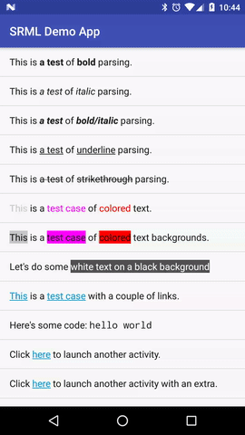

# SRML [](https://travis-ci.org/jasonwyatt/SRML) [](https://jitpack.io/#jasonwyatt/SRML)

SRML: "String Resource Markup Language"

Mark up your Android string resources with an impressive suite of formatting tags.



## SRML Tags

* [Bold](../../wiki/Tags#bold)
* [Italic](../../wiki/Tags#italic)
* [Underline](../../wiki/Tags#underline)
* [Strikethrough](../../wiki/Tags#strikethrough)
* [Superscript](../../wiki/Tags#superscript)
* [Subscript](../../wiki/Tags#subscript)
* [Code](../../wiki/Tags#code)
* [Color](../../wiki/Tags#color) (foreground and background)
* [Link](../../wiki/Tags#link)
* [Intent](../../wiki/Tags#intent)
* [Drawable](../../wiki/Tags#drawable)
* ... or [create your own](../../wiki/Custom%20Tags) tags!

## Setup 

Add [jitpack.io](https://jitpack.io) to your root `build.gradle` at the end of `repositories`:

```groovy
allprojects {
    repositories {
        ...
        maven { url "https://jitpack.io" }
    }
}
```

Add SRML as a dependency to your app's `build.gradle`:

```groovy
dependencies {
    compile 'com.github.jasonwyatt:SRML:-SNAPSHOT'
}
```

## How to use

```java
// simple case
SRML.getString(context, R.string.mystring);

// parameterized strings
SRML.getString(context, R.string.my_parameterized_string, firstArg, secondArg, ...);

// quantity strings
SRML.getQuantityString(context, R.plurals.my_plurals_resource, quantity, ...format args...);

// String array resources
SRML.getStringArray(context, R.array.my_string_array);
```

Your resources can be arbitrarily complex, involving multiple, nested tags.

## Contributing

Fork the repository, and clone your fork locally.  After you do that, follow these guidelines:

* Make sure you're doing your work on the `develop` branch.
* Make your changes/improvements.
* Make unit tests for your changes/improvements (preferable)
* Be sure both your unit tests *and* the ones already in the project pass.
* Commit, push, and open a pull request. Be sure to reference any bugs or feature enhancements your work pertains to (if any) in the pull request.
* Be ready to discuss your pull request and celebrate its acceptance!

## License

```
   Copyright 2016 Jason Feinstein

   Licensed under the Apache License, Version 2.0 (the "License");
   you may not use this file except in compliance with the License.
   You may obtain a copy of the License at

       http://www.apache.org/licenses/LICENSE-2.0

   Unless required by applicable law or agreed to in writing, software
   distributed under the License is distributed on an "AS IS" BASIS,
   WITHOUT WARRANTIES OR CONDITIONS OF ANY KIND, either express or implied.
   See the License for the specific language governing permissions and
   limitations under the License.
```
